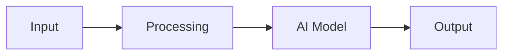
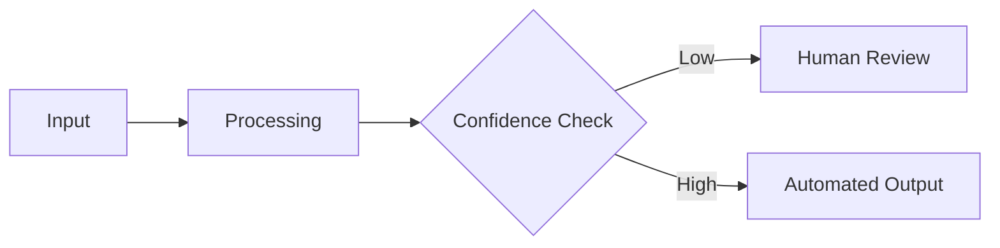

In Machine Learning System Design by Valerii Babushkin and Arseny Kravchenko, the authors dedicate an entire chapter to the topic of system design specifications. They go into a lot of detail about why the design spec is a critical part of an ML project, and that, while not every ML project with a system design doc succeeds, the vast majority of those without one fail. 

While the advice of the authors is specific to ML projects, this logic applies to any AI project (not just good old-fashioned AI). It is also a requirement of ISO 42001. 

I'll be the first to admit that spending a ton of time on a design document can feel like a waste, especially when we want to get to building the actual thing. But it's worth spending time on a good design document, for our future selves if no one else. 

## The Benefits of a System Design Document

As Valerii and Arseny point out, good system design documents are key to project success. They are major factors in reducing the inherent risk to a project, helping to define the necessary steps before the system development begins. In my personal case, there is a formal risk assessment step before the system design that is intended to assess and mitigate risks, but the output of that step serves as input into the system design document. 

Good system design specs also reduce uncertainty about the problem we are solving by establishing boundaries. They also quantify our understanding of what we are going to build, and allow us the opportunity to make a "go/no go" decision. Again, in my own case, there are formal documents for both problem definition and the Go/No Go decision, all part of our AI Management System, but the system design document is central to these. 

## Anatomy of a Good Spec

I like how Valerii and Arseny believe that templates are counterproductive. I can't say that I agree with that, but I do agree that slavish adherence to a template is unnecessary and counterproductive. But templates do help. 

I find that my system design specs are closely aligned with the structure they suggest, albeit much more detailed in terms of governance. 

Every design spec should state the problem it is solving, even if a formal Problem Definition exists elsewhere. The same is true for the impact and risk assessments: even if those are separate documents, as is my case, the system design spec should still reference them. There should also be success criteria and monitoring metrics.

Of course, the actual design consists of diagrams, data sources, and a baseline solution. These are the core of what we engineers usually think about when we discuss system design, and they are the most important part of my system design specs, given that much of the other information exists in more detail elsewhere. But the system design spec is _the_ place for the architectural documentation that will guide development. 

## When to Write It

In my case, the system design document comes after the Problem Definition phase of our AI Software Development Lifecycle, at the beginning of the Development phase. Valerii and Arseny separate the Problem Definition phase and the Solution Definition, and that is similar to how our SDLC separates these processes. 

But it isn't done when the first draft is checked in to version control. Oh no. It is a "living" document that must change as development moves forward and we learn more. Just today, I updated a system design spec for an AI system I'm building for our sister company after a meeting with stakeholders. The meeting revealed an important decision tree with what was previously implicit knowledge that must be made explicit as part of the system I'm building. I documented this in the system design spec (in a Mermaid diagram since all my docs are in Markdown), updated the revision history and version number, and checked it in for review by members of the governance committee. 

I'm sure there will be many more revisions as the project progresses. And that's ok, just part of a good design spec. If it just sits there, what good is it?

## Starter Template

As mentioned, I disagree with the idea that all templates are bad. Just slavish adherence to templates. 

Here is a fairly comprehensive system design spec template that covers plenty of governance ground while still complying with the requirements of classic ML specs. It's a guide, not gospel, so treat it as such. If you don't have formal governance, or don't want/need a section, even one a case-by-case basis, rip it out. 

System design docs are here to help.

````
---
id: SD-XXX
title: "[System Name] System Design Specification"
version: 1.0
created_date: YYYY-MM-DD
last_updated: YYYY-MM-DD
authors:
  - [Author Name]
reviewers:
  - [Reviewer Names]
type: "docs"
---

# AI System Design Specification: [System Name]

## Part 1: System Definition

### 1. System Overview

#### 1.1 Business Problem
[Describe the current manual process, pain points, inefficiencies, and business impact. Include quantitative metrics where possible (e.g., hours spent, error rates, costs).]

#### 1.2 Solution
[Describe the AI-powered solution at a high level. What will the system do? How will it use AI/ML? What is the intended workflow? What is automated vs. human-in-the-loop?]

#### 1.3 Success Criteria
- **Primary**: [Main measurable outcome that determines project success]
- **Secondary**: [Supporting operational metric]
- **Tertiary**: [Additional quality or efficiency metric]

### 2. Requirements

#### 2.1 Functional Requirements
1. [Core capability 1]
2. [Core capability 2]
3. [Data integration requirement]
4. [Automation or human-in-the-loop requirement]
5. [Output/response generation requirement]
6. [Escalation or exception handling requirement]
7. [Audit trail and logging requirement]
8. [User interface requirement (if applicable)]

#### 2.2 Non-Functional Requirements
- **Performance**: [Response time, throughput targets]
- **Availability**: [Uptime requirements, operational hours]
- **Scalability**: [Current and projected load handling]
- **Accuracy**: [Quality metrics and targets]
- **Security**: [Encryption, access control requirements]
- **Auditability**: [Logging, retention, traceability requirements]

#### 2.3 Compliance Requirements
- [ISO 42001 AIMS requirements applicable to this system]
- [SOC2 controls]
- [Data privacy and DPA requirements]
- [Industry-specific compliance (if applicable)]

## Part 2: Technical Design

### 3. Architecture

#### 3.0 System Architecture Overview

**High-Level Architecture Diagram**:
[Include or reference architecture diagram showing major components and data flow]

**Key Data Flow Patterns**:

**Pattern 1: Happy Path**


**Pattern 2: Escalation Path**


#### 3.1 Input Channels
[Describe how data enters the system: APIs, email, file uploads, databases, etc. Include data formats and validation rules.]

#### 3.2 Processing

**Core Processing Architecture**: [Technology stack: Python, LangChain, cloud platform, etc.]

**Processing Components**:

1. **[Component 1 Name]**: [Purpose and responsibilities]

2. **[Component 2 Name]**: [Purpose and responsibilities]

3. **[AI Model Integration]**: [Which models are used, for what purpose, how they're called]

4. **[Data Retrieval/Tools]**: [External systems accessed, APIs called, tool registry]

5. **[Confidence Scoring]**: [How system determines confidence in outputs, thresholds for automation vs. escalation]

6. **[Human-in-the-Loop]**: [When and how humans intervene, escalation triggers]

#### 3.3 Output Channels
[How results are delivered: email, API responses, database writes, UI, notifications, etc.]

#### 3.4 Infrastructure

**Deployment Platform**: [Cloud provider, container orchestration, compute resources]

**Core Services**:
- **Compute**: [GKE, ECS, Lambda, etc.]
- **Storage**: [Database types and purposes]
- **Networking**: [VPC, load balancing, ingress]
- **Monitoring**: [Logging, metrics, alerting platforms]

**Scalability Approach**: [Horizontal scaling, autoscaling policies, resource limits]

### 4. AI/ML Components

#### 4.1 Model Selection

**Primary Model(s)**:
- **Model**: [Model name and version]
- **Provider**: [OpenAI, Anthropic, Google, open-source, etc.]
- **Purpose**: [What this model does in the system]
- **Rationale**: [Why this model was selected]

#### 4.2 Model Limitations

[Document known limitations of the AI models used, including:]
- Context window constraints
- Known failure modes
- Biases or fairness concerns
- Languages or domains with poor performance

### 5. Data Management

#### 5.1 Data Sources

**Primary Data Sources**:
1. **[Source 1]**: [Purpose, update frequency, data quality]
2. **[Source 2]**: [Purpose, update frequency, data quality]

**Data Integration Methods**: [APIs, batch imports, real-time streams, web scraping]

#### 5.2 Data Privacy & Security

- **Data Classification**: [Public, internal, confidential, sensitive]
- **PII Handling**: [What PII is processed, how it's protected]
- **Data Retention**: [How long data is kept, deletion policies]
- **Access Controls**: [Who can access what data]
- **Encryption**: [In transit and at rest]

#### 5.3 Data Quality

**Quality Checks**:
- [Validation rule 1]
- [Validation rule 2]
- [Freshness requirements]

**Error Handling**: [What happens when data quality is insufficient]

### 6. Risk Assessment

#### 6.1 Key Risks

[Reference the system's risk assessment document. Summarize top 3-5 risks:]

| Risk | Likelihood | Impact | Mitigation |
|------|------------|--------|------------|
| [Risk 1] | [H/M/L] | [H/M/L] | [Control measures] |
| [Risk 2] | [H/M/L] | [H/M/L] | [Control measures] |

#### 6.2 Failure Modes

**Failure Mode 1: [Description]**
- **Impact**: [What happens if this fails]
- **Detection**: [How we detect this failure]
- **Response**: [Automated or manual recovery procedure]

**Failure Mode 2: [Description]**
- **Impact**: [What happens if this fails]
- **Detection**: [How we detect this failure]
- **Response**: [Automated or manual recovery procedure]

### 7. Security Controls

#### 7.1 Input Validation
- [Sanitization rules]
- [Size limits]
- [Format validation]
- [Prompt injection prevention]

#### 7.2 Access Controls
- **Authentication**: [How users/services authenticate]
- **Authorization**: [Role-based access model]
- **API Security**: [Rate limiting, API keys, etc.]

#### 7.3 Monitoring & Detection
- [Anomaly detection]
- [Security event logging]
- [Alert thresholds]

### 8. Testing & Validation

#### 8.1 Pre-Deployment Testing

**Unit Tests**: [Component-level testing approach]

**Integration Tests**: [End-to-end workflow testing]

**AI Model Evaluation**:
- **Test Dataset**: [Size and composition]
- **Evaluation Metrics**: [Accuracy, precision, recall, F1, etc.]
- **Acceptance Criteria**: [Minimum performance thresholds]

**User Acceptance Testing**: [Stakeholder validation process]

#### 8.2 A/B Testing Strategy (if applicable)

- **Control Group**: [Current process]
- **Test Group**: [AI-powered process]
- **Duration**: [Testing period]
- **Success Metrics**: [What we're measuring]
- **Decision Criteria**: [When to proceed with rollout]

### 9. Deployment Plan

#### 9.1 Rollout Phases

**Phase 1: [Phase Name]**
- **Scope**: [Limited user group, use cases, or data volume]
- **Duration**: [Timeline]
- **Success Criteria**: [Metrics to proceed to next phase]

**Phase 2: [Phase Name]**
- **Scope**: [Expanded scope]
- **Duration**: [Timeline]
- **Success Criteria**: [Metrics to proceed to next phase]

**Phase 3: [Full Production]**
- **Scope**: [Complete rollout]
- **Monitoring**: [Enhanced monitoring during stabilization]

#### 9.2 Rollback Plan

**Rollback Triggers**: [Conditions that require rollback]

**Rollback Procedure**: [Steps to revert to previous state]

**Data Handling**: [How in-flight transactions are managed during rollback]

### 10. Monitoring & Observability

#### 10.1 Key Metrics

**Business Metrics**:
- [Metric 1]: [Definition and target]
- [Metric 2]: [Definition and target]

**Technical Metrics**:
- [Metric 1]: [Definition and target]
- [Metric 2]: [Definition and target]

**AI/ML Metrics**:
- [Metric 1]: [Definition and target]
- [Metric 2]: [Definition and target]

#### 10.2 Dashboards

**Operational Dashboard**: [Real-time system health, processing volume, error rates]

**Business Impact Dashboard**: [KPI tracking, ROI metrics, efficiency gains]

**AI Performance Dashboard**: [Model accuracy, confidence scores, escalation rates]

#### 10.3 Alerting

**Critical Alerts**: [System down, security breach, data loss]

**Warning Alerts**: [Performance degradation, elevated error rates, approaching capacity]

**Informational Alerts**: [Daily summaries, weekly reports]

### 11. Revision History

| Version | Date | Author | Summary of Change |
| ------- | ------ | ------ | ----------------- |
| 1.0     | YYYY-MM-DD | [Author] | [Initial version or change summary] |

### 13. Appendix

````